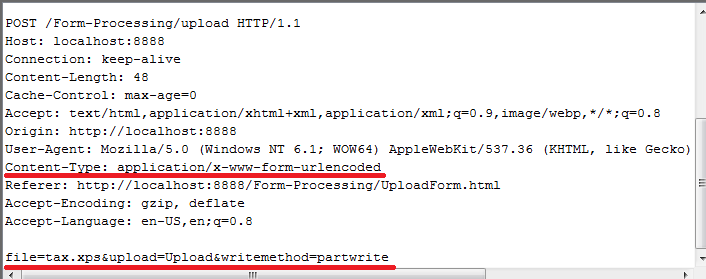

# Dealing with file uploads

## Short history
* 1993: HTML is born
* 1995: `<input type="file">` appears
* 1999-2002: AJAX introduced: XMLHttpRequest, ActiveX
* ~2010: multiple file selection (IE10+)
* 2010-2011: HTML5 File API, FormData, FileReader (IE10+)
* 2011: WebSockets standardized
* **Future (?)** No files on your computer, no need for file upload? `<input type="cloud">` is coming?

## How things changed in the last few years


All the tutorials, instructions, workarounds, hacks are mostly for
browsers released before 2010 --- and that market share is getting
smaller and smaller with each day. Should we care?

## Old school upload form
```html
<form method="POST" action="/upload" enctype="multipart/form-data">
  <input type="file" id="myfile" name="myfile">
  <input type="submit" value="Upload" name="submit">
</form>
```

* **enctype="application/x-www-form-urlencoded"**
Default, simple encoding which presents the fields as name=value strings separated by ampersands (&) and uses special escape.
* **enctype="multipart/form-data"**
This implies that the form data set is encoded so that each form field has certain structure and is separated by special boundary




After POST you need to redirect to another page: **Post/Redirect/Get (PRG) design pattern**


## Why should you care (Maybe enough of history :)

* HTTP/1.1 hasn't changed much since late 1990s.
HTTP/2 is being introduced just now.
* WebSockets (full-duplex/simultaneously bidirectional connection) can be used
in a much richer way for file upload

## File upload using FormData

```js
var fd = new FormData();
fd.append('file', input.files[0]);

$.ajax({
  url: 'http://localhost:3000/upload',
  data: fd,
  processData: false,
  contentType: false,
  type: 'POST',
  success: function(data){
    alert(data);
  }
});
```

## Drag and drop


### Workarounds for older browsers
* Flash
* iframe

# Security

The HTML 4.01 specification describes the value attribute for a file input field by saying that browsers (user agents) "may use the value of the value attribute as the initial file name."
`<INPUT TYPE="file" VALUE="/etc/passwd">`

## Cross-domain upload

Works? How to enable?

## Other topics
Progress bars
Uploading whole folders
Size
Immediate preview: http://www.javascripture.com/FileReader
Is file upload resume possible?
File upload through WebSockets API
Streaming
HTML/2.0

## Ready to use libraries
jQuery file upload plugin

# Backend

## Experience with Python Flask

## Using Micro-libs
* https://github.com/jakutis/httpinvoke
